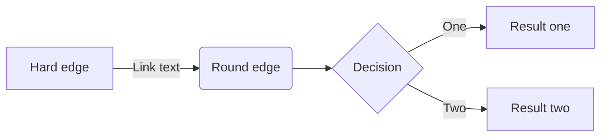
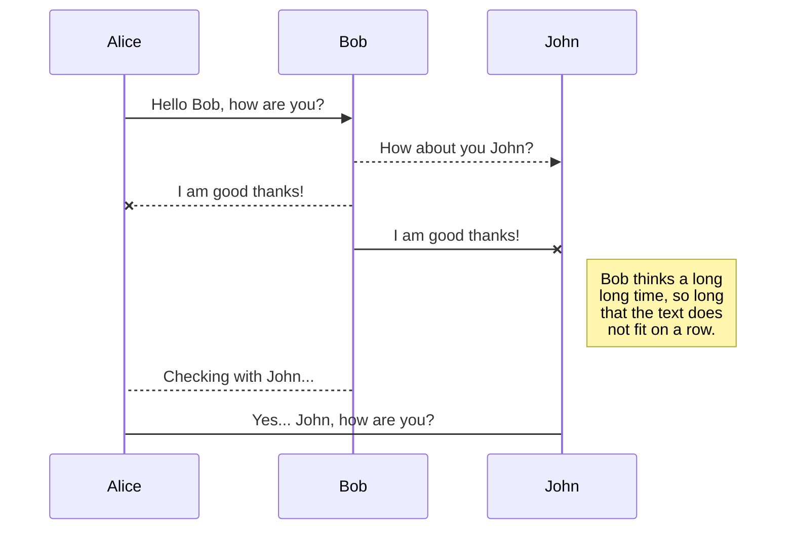
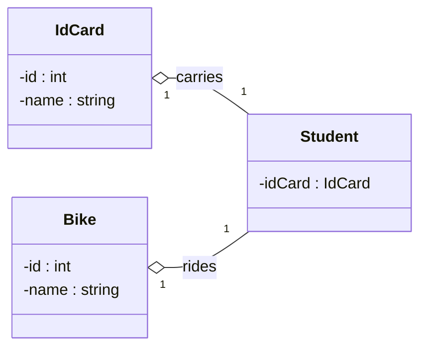
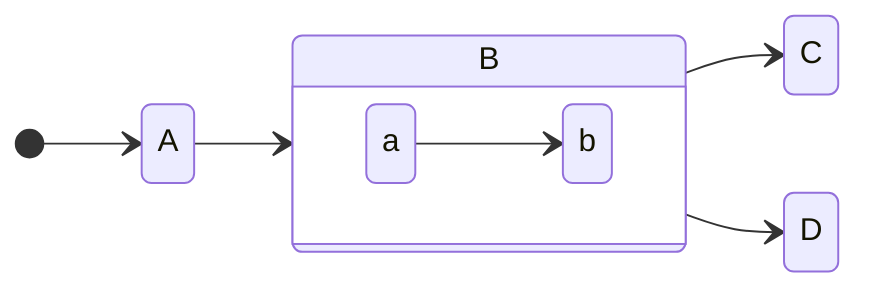
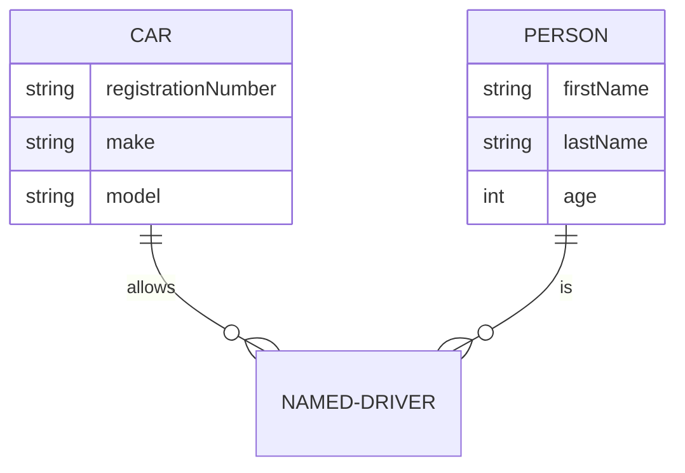
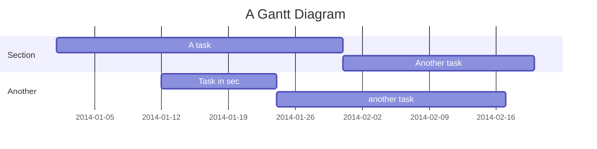
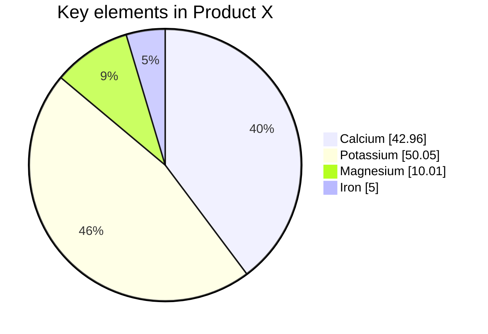
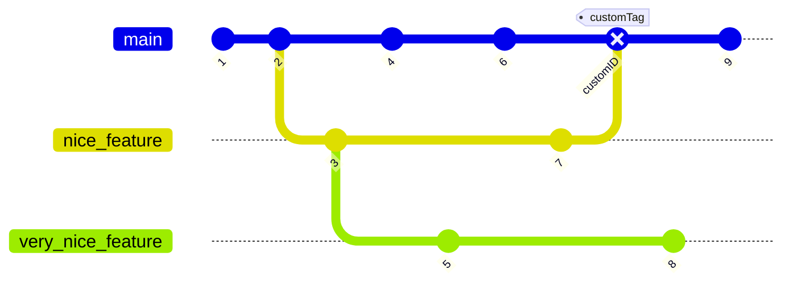

[MermaidJS](https://mermaid.js.org) is library for generating svg charts and diagrams from text. You can edit your mermaid code using [Online Mermaid Editor](https://mermaid.live).

## Flowchart



## Sequence Diagram



## Class Diagram


````tpl

````

<--->



### State Diagram



````tpl

````

<--->




## Entity Relationship Diagram



````tpl

````
<--->





### Gantt

````tpl

````


## Pie Chart



<!-- prettier-ignore -->
````tpl

````

<--->




## Gitgraph Diagram



## Mindmap

Mermaid also support [mindmap](https://mermaid.js.org/syntax/mindmap.html) now, but we don't use it yet.

```js
<script type="module">
  import mermaid from 'https://cdn.jsdelivr.net/npm/mermaid@9/dist/mermaid.esm.min.mjs';
  import mindmap from 'https://cdn.jsdelivr.net/npm/@mermaid-js/mermaid-mindmap@9/dist/mermaid-mindmap.esm.min.mjs';
  await mermaid.registerExternalDiagrams([mindmap]);
</script>
```

